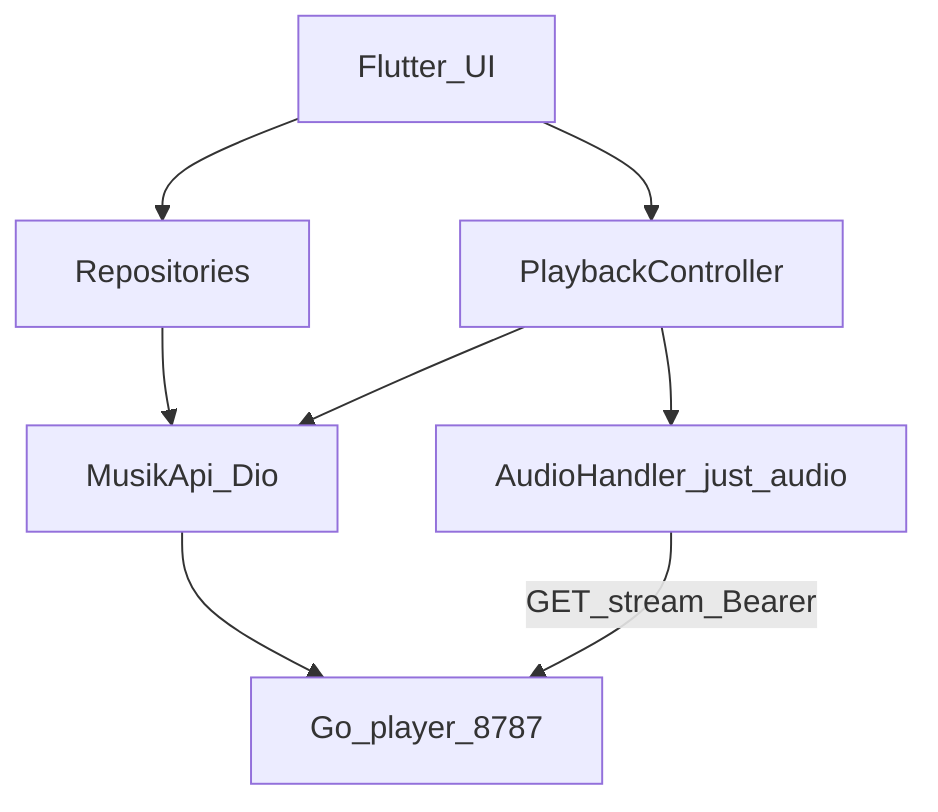

# Руководство по мобильному клиенту musik

Один владелец. Мобилка — **полноценный клиент Go API** (`:8787`), не Python worker.

Канон маршрутов: [API.md](API.md) · OpenAPI: `GET /api/openapi.json` · PWA: [mobile/README.md](../mobile/README.md)

Ниже: (A) контракт API для любого native-клиента · (B) **полный план Flutter-приложения с 100% паритетом веб-UI**.

---

# A. Контракт API (кратко)

## A1. Два режима потребления

| Режим | Когда | Как |
|-------|--------|-----|
| **App protocol** | Свой UI | JSON-сессия + `/api/stream/{id}` + `/api/events` |
| **Share radio** | «Просто слушай в любом плеере» | `GET /listen/{token}.mp3` — непрерывный MP3 |

## A2. Auth

| Способ | Использование |
|--------|----------------|
| Cookie `musik_session` | WebView / PWA после `POST /api/auth/login` |
| `Authorization: Bearer <MUSIK_API_TOKEN>` | **Рекомендуется для Flutter** (flutter_secure_storage) |
| Share token в path | Только `/listen/{token}` |

Нюансы: `/api/stream` и `/api/artwork` под auth; `401` → экран логина; `GET /api/auth/me` решает boot.

## A3. Сессии

- Вкус общий; `session_id` — на устройство/вкладку.
- Старт: `radio/start` | `play` | `mixes/{kind}/play` | `session/start`.
- Events и `/api/now?session_id=` всегда с этим id.
- После рестарта player — сессия умерла → новый start.

## A4. Playback loop

```
start → current.stream (+ Bearer)
track_start → progress(~4s) → track_end|skip → next.stream
like|dislike → обновляют EMA (не обязательны для смены трека)
```

`POST /api/play` / fixed mixes: в конце списка `ended: true`, **не** уходить в радио.  
Jump: `POST /api/session/jump` `{session_id, index}`.

## A5. Share radio

Владелец: `POST/GET/DELETE /api/share/radio`.  
Слушатель: `GET /listen/{token}.mp3` без auth. Не двигает вкус. Нужны `ffmpeg` на server и `MUSIK_PUBLIC_BASE_URL` для LAN.

## A6. Ошибки

`{"error":"…","code":"auth_required|not_found|…"}` · HTTP 400/401/404/503.

---

# B. План разработки Flutter (100% паритет веб)

Цель: нативное приложение (Android + iOS), которое повторяет **весь** функционал [Web UI](../player/internal/static/) — экраны, полки, плеер, избранное, discover, share radio, auth — без деградации UX на телефоне.

Источник правды по поведению: `player/internal/static/app.js` + этот документ + [API.md](API.md).

---

## B0. Definition of Done (паритет)

Приложение считается готовым, когда выполнен чеклист **B12**. Критерий: любой сценарий с веб-страницы воспроизводится во Flutter без «заглушек» и без ручного curl.

Вне скоупа (веб тоже не даёт как product UI, только API):

- multi-user / OAuth;
- прямой доступ к Python worker `:8790`;
- offline-first библиотека на устройстве (опционально phase 2+);
- Icecast title metadata в share-stream.

---

## B1. Feature matrix: Web → Flutter

| # | Функция веба | API | Flutter screen / module | Приоритет |
|---|--------------|-----|-------------------------|-----------|
| 1 | Login / logout / gate | `auth/me`, `login`, `logout` | `LoginPage`, secure storage | P0 |
| 2 | Настройка base URL сервера | — | `SettingsPage` (LAN IP) | P0 |
| 3 | Tab: Главная | — | `HomePage` | P0 |
| 4 | ▶ Радио | `POST /api/radio/start` | Home action → Player | P0 |
| 5 | Поделиться радио | `POST /api/share/radio` | Share sheet + copy | P0 |
| 6 | Обновить миксы + poll job | `POST /api/jobs/mix_pack`, `GET /api/jobs/{id}` | Home action + snackbar | P1 |
| 7 | Полка «Для тебя» (миксы) | `GET /api/mixes`, `POST /api/mixes/{kind}/play` | Horizontal shelf | P0 |
| 8 | Полка «Дни недели» | mixes `weekday_*` | Shelf, highlight today | P0 |
| 9 | Любимые песни / артисты / альбомы | `GET /api/favorites` | Shelves + hearts | P0 |
| 10 | Похожее на любимое | `GET /api/recommend/favorites` | Shelf | P1 |
| 11 | Полки Артисты / Альбомы / Треки | `artists`, `albums`, `library` | Shelves + «все →» | P0 |
| 12 | Открытия: новые / старое | `discover/albums`, `discover/resurfaced` | Cards + tips panel | P1 |
| 13 | Tab: Сейчас (now playing) | stream + events | `PlayerPage` | P0 |
| 14 | Seek / play-pause / skip | local player + `events` | Transport | P0 |
| 15 | Like track / dislike | favorites toggle + `events` like/dislike | Transport | P0 |
| 16 | ♥ артист / ♥ альбом | `favorites/toggle` type | Chips | P0 |
| 17 | Похожее (сейчас) | `similar/{id}`, `similar/artists|albums` | → playFixed | P1 |
| 18 | В «Потом» | `POST /api/later` | Icon | P1 |
| 19 | Полный плейлист + jump | `session/jump`, tracks[] | Playlist list | P0 |
| 20 | Очередь radio (up next) | `queue` в ответах | Queue list | P0 |
| 21 | Mini-player | локальный state | Bottom bar на всех tabs | P0 |
| 22 | Tab: Библиотека | library / artists / albums / favorites | `LibraryPage` + search | P0 |
| 23 | Сегменты tracks/artists/albums/favorites | те же API | Segmented control | P0 |
| 24 | Поиск/фильтр | client-side filter | TextField | P0 |
| 25 | Play track/artist/album из lib | `POST /api/play` | Tap → Player | P0 |
| 26 | Tab: Профиль | `profile`, `metrics/weekly` | `ProfilePage` | P0 |
| 27 | Maturity badge | profile.maturity | AppBar subtitle | P0 |
| 28 | Управление share-ссылками | list/create/revoke | Profile section | P0 |
| 29 | Toast / ошибки | envelope | SnackBar | P0 |
| 30 | Resume session | `GET /api/now?session_id=` | boot restore | P1 |
| 31 | Background audio + lock screen | OS | audio_service / just_audio | P0 |
| 32 | Artwork artwork с Bearer | `/api/artwork/{id}` | CachedNetworkImage + headers | P0 |

---

## B2. Стек и пакеты

| Слой | Выбор | Зачем |
|------|--------|--------|
| SDK | Flutter 3.24+ / Dart 3 | |
| State | `riverpod` (+ code gen optional) | session, player, catalog |
| HTTP | `dio` | interceptors Bearer, 401→logout |
| Secure | `flutter_secure_storage` | API token / password optional |
| Prefs | `shared_preferences` | base URL, last session_id |
| Audio | `just_audio` + `audio_service` | background, media controls, Range |
| Images | `cached_network_image` | artwork с auth headers |
| Share | `share_plus` | share radio URL |
| Clipboard | `flutter/services` | copy link |
| Routing | `go_router` | tabs + login redirect |
| Models | `freezed` + `json_serializable` | API DTOs |
| Logging | `talker` / `logger` | debug events |

Аудио: библиотека смешанная (mp3/flac/m4a/ogg). `just_audio` на Android/iOS обычно тянет через платформенные декодеры; flac/ogg проверить на целевых девайсах. Fallback: если codec fail → `skip` + toast.

---

## B3. Архитектура

```
lib/
  main.dart
  app.dart                 # MaterialApp.router, theme
  core/
    config.dart            # default base URL
    theme.dart             # цвета веба: --bg/#100c0a, --accent/#e07a3a, Syne/Manrope → google_fonts
    errors.dart            # ApiException(code, message)
  data/
    api/
      musik_api.dart       # Dio client, все endpoints
      auth_interceptor.dart
      endpoints.dart
    models/                # Track, Mix, Artist, Album, Profile, Share, Job…
    repositories/
      auth_repository.dart
      catalog_repository.dart
      playback_repository.dart
      favorites_repository.dart
      share_repository.dart
  domain/
    playback/
      playback_controller.dart   # session_id, current, queue, fixed, events loop
      listen_accumulator.dart    # listened_sec
    maturity.dart
  features/
    auth/login_page.dart
    home/home_page.dart
    home/widgets/shelf.dart
    player/player_page.dart
    player/mini_player.dart
    library/library_page.dart
    profile/profile_page.dart
    settings/settings_page.dart
    discover/tips_sheet.dart
  services/
    audio_handler.dart     # audio_service wrapper
    artwork_cache.dart
```

**Правило:** UI не вызывает Dio напрямую — только repositories / `PlaybackController`.



---

## B4. Экраны и навигация

Shell: `StatefulShellRoute` / bottom nav — **Главная · Сейчас · Библиотека · Профиль** (+ overflow Settings).

| Route | Поведение |
|-------|-----------|
| `/login` | пароль **или** вставка API token; поле Base URL |
| `/home` | actions + все полки как в вебе |
| `/player` | now playing + playlist/queue |
| `/library` | segments + search |
| `/profile` | maturity, metrics, shares, logout |
| `/settings` | base URL, token rotate hint, about |

**Mini-player:** overlay над bottom nav, скрыт если нет `current`. Tap → `/player`.

**Login gate:** `redirect` в go_router: если `!auth.ok` → `/login`.

Визуал: тёмная тёплая палитра веба (не дефолтный Material purple). Горизонтальные shelves с snap/physics; карточки миксов с tone-a/b/c.

---

## B5. PlaybackController (сердце приложения)

Состояние:

```dart
sessionId, mode, maturity, fixed,
current: Track?,
playlist: List<Track>,   // fixed
queue: List<QueueItem>,  // radio up-next
index: int,
rating: like|dislike|null,
playing: bool,
position, duration,
```

Методы (1:1 с `app.js`):

| Method | API / local |
|--------|-------------|
| `startRadio({seed?})` | `POST /radio/start` → setUrl → play → `track_start` |
| `playFixed(body)` | `POST /play` |
| `playMix(kind)` | `POST /mixes/{kind}/play` |
| `jumpTo(index)` | `POST /session/jump` |
| `togglePlay()` | local |
| `seek(pos)` | local (Range) |
| `skip()` | `events skip` → load `next` |
| `onCompleted()` | `events track_end completed` → next or stop if fixed ended |
| `like()` / `dislike()` | `events` + UI |
| `toggleFavorite(type,…)` | `/favorites/toggle` (+ optional like) |
| `addLater()` | `POST /later` |
| `playSimilarNow()` | similar APIs → `playFixed(track_ids)` |
| `restore()` | `GET /now?session_id=` |

Цикл событий (обязателен):

1. Перед play URL: абсолютный `base + current.stream`, headers `Authorization: Bearer`.
2. После реально начавшегося playback → `track_start`.
3. Timer 4s → `progress` с `position_sec`, `duration_sec`, `listened_sec`.
4. На end/skip обработать `next == null` / `ended` / `fixed`.
5. Обновить mini-player / media notification (title, artist, artwork).

**Не** использовать share `/listen` внутри app-player для основного UX — только app protocol (иначе нет skip/like/seek по трекам).

---

## B6. Реализация API-слоя (полный список методов)

`MusikApi` должен покрыть всё, что дергает веб:

```
authMe, login, logout
health, profile, metricsWeekly, status
library, artists, albums, track(id)
streamUrl(id), artworkUrl(id)          // builders
radioStart, play, sessionJump, sessionStart
now, queue, queueRefresh
events(EventBody)
mixes, mixPlay(kind)
laterList, laterAdd, laterRemove
favoritesList, favoritesToggle, favoritesStatus
recommendFavorites, recommendSeed
similarTrack, similarArtists, similarAlbums
discoverAlbums, discoverResurfaced
jobsEnqueue(kind), jobGet(id), libraryRescan
shareCreate, shareList, shareRevoke
```

Интерцептор:

- добавляет Bearer;
- на `401` чистит storage и шлёт stream `AuthExpired`;
- парсит `{error,code}` в `ApiException`.

---

## B7. Фазы разработки (roadmap Flutter)

### Phase 0 — Skeleton (3–5 дней)

- Создание проекта `musik_app`, flavors `dev/prod`.
- Theme + google_fonts (Manrope/Syne).
- Settings: base URL + token в secure storage.
- Dio + auth interceptor + `auth/me` / login UI.
- Пустые 4 вкладки + routing.

**Exit:** логин к LAN player, health/profile на экране.

### Phase 1 — Playback core (1–1.5 недели)

- `just_audio` + `audio_service` (lock screen, headset).
- `PlaybackController`: radio start, events loop, skip, seek, progress.
- `PlayerPage` + mini-player.
- Artwork с auth headers.
- Resume `session_id` из prefs.

**Exit:** радио играет в фоне; skip меняет трек; like/dislike уходят на сервер.

### Phase 2 — Home shelves (1 неделя)

- Все полки главной: mixes, weekdays, favorites×3, similar, artists, albums, tracks.
- Horizontal `ListView` + play on tap.
- Actions: Радио, Поделиться (`share_plus`), Обновить миксы (job poll).
- Discover cards + tips bottom sheet → play album/list.

**Exit:** визуальный паритет главной; любой shelf запускает playback.

### Phase 3 — Library (3–5 дней)

- Segments + client search.
- Tracks list (♥, play, later).
- Artists/albums grid.
- Favorites tab (все типы).

**Exit:** поиск и play из библиотеки = веб.

### Phase 4 — Player extras + Profile (3–5 дней)

- Полный playlist UI + jump.
- Queue для radio.
- Chips: fav artist/album, similar now, later, dislike.
- Profile: maturity, weekly metrics, share list create/copy/revoke, logout.
- Maturity в app bar.

**Exit:** 100% feature matrix P0/P1.

### Phase 5 — Polish & QA (1 неделя)

- Codec matrix (mp3/flac/m4a) на Android+iOS.
- Ошибки сети / 503 share busy / session expired.
- Deep link optional: `musik://play?…` (не обязательно).
- Performance: не грузить весь `/library` на каждый кадр — cache + refresh.
- Accessibility: крупные hit targets, semantics.
- Чеклист B12 зелёный.

### Phase 6 (optional later)

- Локальный LRU-кэш треков.
- Виджет / CarPlay / Android Auto.
- Гостевой режим: только share URL player без token.

---

## B8. Маппинг UI-состояний веба

| Web state | Flutter |
|-----------|---------|
| `sessionId` (sessionStorage) | `SharedPreferences` |
| `current`, `playlist`, `fixedMode` | `PlaybackController` |
| `favoriteIds/Artists/Albums` | `FavoritesNotifier` Set |
| `library` cache | `CatalogNotifier` |
| login-gate | go_router redirect |
| toast | SnackBar / overlay |
| jobPollTimer | `Stream.periodic` / Cancelable |
| mini hidden | `current == null` |

---

## B9. Auth UX во Flutter (рекомендация)

На экране логина два режима (toggle):

1. **Пароль** → `POST /api/auth/login` — на mobile cookie неудобны; после login сразу предложить сохранить **API token** из настроек сервера (пользователь вставляет `MUSIK_API_TOKEN` один раз) — это основной prod-путь.
2. **API token** → сохранить в Keychain/Keystore, дальше только Bearer.

Base URL обязателен: `http://192.168.x.x:8787` (без trailing slash). Кнопка «Проверить» → `GET /api/health` + `auth/me`.

Logout: удалить token + `POST /logout` (best-effort) + stop audio.

---

## B10. Тема и motion (паритет ощущений)

- Фон: тёмный градиент / radial spots как в `style.css` (`#100c0a`, accent `#e07a3a`, teal `#3d8f7a`).
- Brand «musik» — крупная display-типографика на login и home header.
- Shelves: горизонтальный скролл, не «dashboard cards» сеткой на первом экране.
- Минимум 2–3 анимации: появление полок, mini-player slide-in, art fade при смене трека.
- Не использовать дефолтный Inter/Roboto-only; подключить Manrope + Syne через `google_fonts`.

---

## B11. Тест-план

### Unit

- Парсинг error envelope.
- `ListenAccumulator` (рост listened_sec).
- Maturity label mapping.

### Integration (mock Dio)

- radio start → track_start → skip → next id.
- fixed playlist end → no auto radio.
- 401 → auth expired.

### Device QA

- Android 12+ / iOS 16+.
- Background 10+ мин, lock screen skip.
- flac + mp3 в одной сессии.
- Share link opens in VLC (system share), app itself uses app protocol.
- LAN disconnect toast; reconnect restore.

---

## B12. Acceptance checklist (100% веб)

- [ ] Логин паролем или token; logout
- [ ] Base URL настраивается
- [ ] Радио старт + бесконечная очередь
- [ ] Миксы «Для тебя» и weekday play
- [ ] Обновить миксы (job) завершается и обновляет полку
- [ ] Favorites shelves + toggle ♥ track/artist/album
- [ ] Recommend favorites shelf
- [ ] Catalog shelves artists/albums/tracks
- [ ] Discover new/old tips → play
- [ ] Player: play/pause, seek, skip, like, dislike
- [ ] Later
- [ ] Similar now
- [ ] Full playlist jump (fixed)
- [ ] Mini-player на всех вкладках
- [ ] Library segments + search + play
- [ ] Profile maturity + weekly metrics
- [ ] Share create / copy / revoke / system share
- [ ] Artwork отображается
- [ ] Background audio + OS controls
- [ ] Session restore after app kill (если server session жива)
- [ ] 401 возвращает на login
- [ ] Progress events видны в росте profile на сервере

---

## B13. Порядок файлов в репо (предложение)

```
mobile/
  README.md          # pointer сюда
  flutter/           # сам проект (создать в Phase 0)
    pubspec.yaml
    lib/…
```

Не класть секреты в git. Token только в secure storage / CI secrets для e2e.

---

## B14. Оценка

| Phase | Effort |
|-------|--------|
| 0 Skeleton | 3–5 d |
| 1 Playback | 5–8 d |
| 2 Home | 5–7 d |
| 3 Library | 3–5 d |
| 4 Player+Profile | 3–5 d |
| 5 Polish | 5 d |
| **Total** | **~5–7 недель** 1 разработчик |

---

## B15. Env на стороне server (для мобилки)

| Env | Зачем |
|-----|--------|
| `MUSIK_PLAYER_ADDR=0.0.0.0:8787` | доступ с телефона |
| `MUSIK_PUBLIC_BASE_URL=http://192.168.x.x:8787` | абсолютные share URL |
| `MUSIK_PASSWORD` / `MUSIK_API_TOKEN` | вход |
| `MUSIK_SECURE_COOKIE=1` | только если HTTPS |
| `MUSIK_SHARE_BITRATE` / `MUSIK_SHARE_MAX_LISTENERS` | эфир |

См. [DEPLOY.md](DEPLOY.md).

---

## B16. С чего начать завтра

```bash
# server
export MUSIK_PLAYER_ADDR=0.0.0.0:8787
export MUSIK_API_TOKEN=…   # вставить в Flutter settings
export MUSIK_PUBLIC_BASE_URL=http://<lan-ip>:8787

# client
flutter create mobile/flutter --org app.musik --project-name musik_app
# Phase 0: dio + login + health
```

Первый вертикальный срез: **Login → Radio → lock-screen skip**. Потом полки.
